<!-- PROJECT SHIELDS -->

[![Contributors][contributors-shield]][contributors-url]
[![Forks][forks-shield]][forks-url]
[![Stargazers][stars-shield]][stars-url]
[![Issues][issues-shield]][issues-url]
[![MIT License][license-shield]][license-url]
[![LinkedIn][linkedin-shield]][linkedin-url]

<!-- PROJECT LOGO -->
<br />

<p align="center">
  <a href="https://github.com/DRL-CASIA/Perception/">
    
  </a>

  <h3 align="center">中国科学科院自动化研究所--Team Neurons</h3>
  <p align="center">
    Time to start！
    <br />
    <a href="https://github.com/DRL-CASIA/Perception"><strong>Wiki</strong></a>
    <br />
    <br />
    <a href="https://github.com/DRL-CASIA/Perception">查看Demo</a>
    ·
    <a href="https://github.com/DRL-CASIA/Perception/issues">报告Bug</a>
    ·
    <a href="https://github.com/DRL-CASIA/Perception/issues">提出新特性</a>
  </p>

</p>

## 相关工作及成果

[所内报道：深度强化学习团队提出基于深度强化学习的未知环境自主探索方法](http://www.ia.ac.cn/xwzx/kydt/202007/t20200728_5646953.html)

[公众号报道：团队新作 | 基于深度强化学习的未知环境自主探索方法](https://mp.weixin.qq.com/s/E68P5j2chxgenZOiCd0v6g)

发表文献：

 H. Li, Q. Zhang, and D. Zhao. “ Deep reinforcement learning-based automatic exploration for navigation in unknown environment,” IEEE Transactions on Neural Networks and Learning Systems, vol. 31, no. 6, pp. 2064–2076, 2020.  


# 感知模块 
## 目录

- [软件功能介绍](#软件功能介绍)
- [配置及安装](#配置及安装)
  - [开发前的配置要求](#开发前的配置要求)
  - [安装步骤](#安装步骤)
- [依赖工具及环境](#依赖工具及环境)
- [编译及安装方式](#编译及安装方式)
- [软硬件系统框图](#软硬件系统框图)
- [原理介绍与理论支持分析](#原理介绍与理论支持分析)
  - [如何参与开源项目](#如何参与开源项目)
- [软件架构与层级图](#软件架构与层级图)
- [开源协议](#开源协议)
- [设计模式](#设计模式)
- [鸣谢](#鸣谢)

## 软件功能介绍

### 1 Yolo 检测模型

- 模型介绍

<p align="center">
  
哨兵将采集到的图像输入到yolov3-boosting模型中后，该模型可以检测图像中的机器人和装甲板，输出其检测框对应的坐标位置，随后机器人的检测框将与其对应的装甲板检测框进行配对。

- 检测结果

 <p align="center">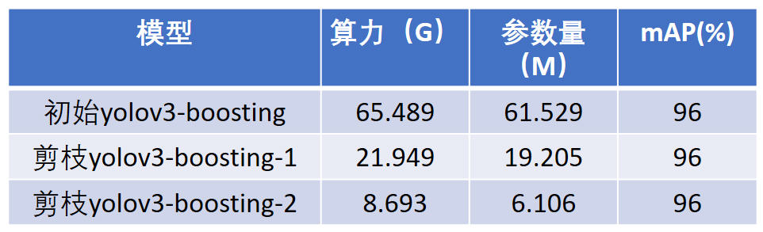
 
表中的剪枝yolov3-boosting-1模型是进行1次残差模块剪枝1次卷积通道剪枝的结果；剪枝yolov3-boosting-2模型是进行了1次残差模块剪枝2次卷积通道剪枝的结果。

- 运行效果图

<p align="center">    

### 2 Robot分类

- 算法流程

<p align="center">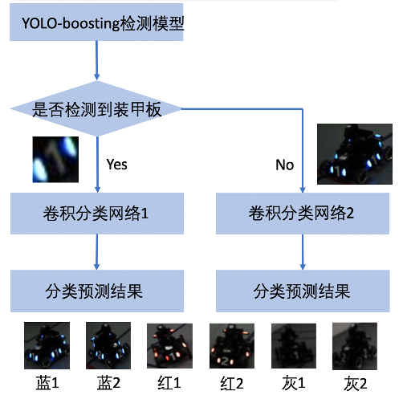

该模型以Yolo是否可以检测到装甲板为条件，将装甲板目标框信息或车体目标框信息输入到卷积分类网络中，实现了对红1车、红2车、蓝1车、蓝2车、灰1车以及灰2车的有效划分。

- 分类结果

<p align="center">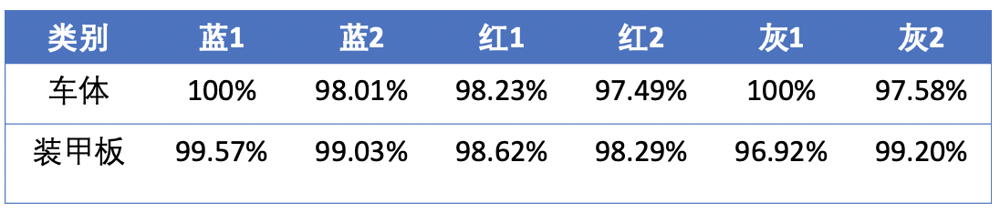

- 运行效果图


### 3 位置获取

#### 3.1 灯条检测及距离解算

- 算法流程

<p align="center">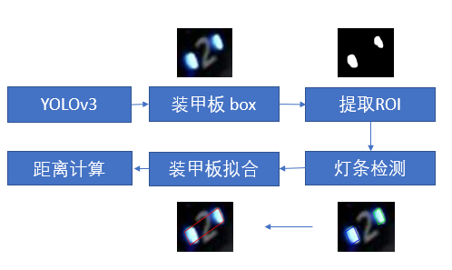

灯条识别采用传统图像处理的方法。输入为YOLO检测出的装甲板框或者车体框，输出为灯条对拟合外接矩形框的四个顶点坐标。

距离解算部分，首先通过相机标定得到两个哨兵相机的内参，并通过识别场地中的二维码四个顶点以及SolvePnP得到两个哨兵相机外参。最后通过灯条检测识别的灯条对四个顶点坐标以及SolvePnP解算出灯条对中心相对哨兵的位置，根据哨兵相机外参和灯条相对哨兵位置解算出灯条中心的世界坐标系下坐标并加补偿当做车体的位置信息。

- 解算结果

<p align="center">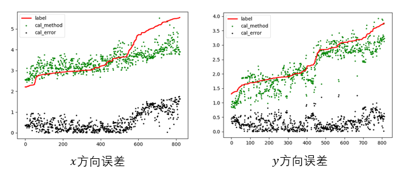

将解算位置的测试结果分别在x轴和y轴排序后进行误差分析，图中label表示真值，cal_method表示解算方法输出的结果，cal_error表示解算的误差

#### 3.2 距离预测

- 算法流程

<p align="center">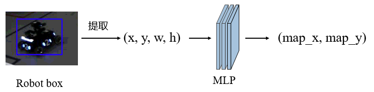

根据哨兵相机高度和俯仰角固定，以及平面假设，利用神经网络来拟合相机坐标系到世界坐标系的转换矩阵，模型为三层的MLP结构，将Yolo检测得到的机器人检测框映射为世界地图坐标。

- 预测结果

<p align="center">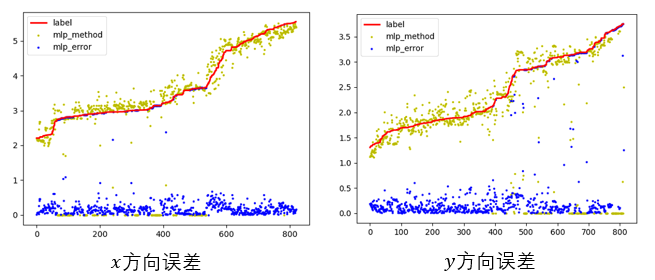

将预测位置的测试结果分别在x轴和y轴排序后进行误差分析，图中label表示真值，mlp_method表示模型输出的结果，mlp_error表示预测的误差

- 距离解算及距离预测效果图

<p align="center">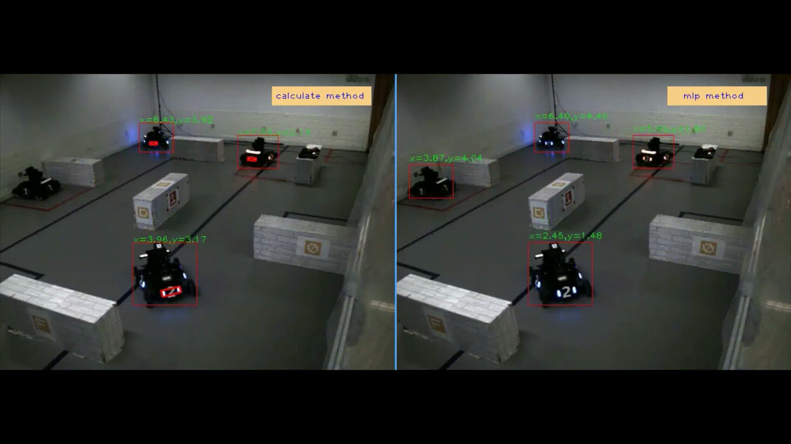

#### 3.3 位置融合

解算方法：可以利用现有算法解算距离，劣势是目标太小，容易漏检和误检

预测方法：整体拟合较好，但有奇异值

针对两种方法的优劣性进行融合，我们选择在未产生奇异值时相信MLP方法，在产生奇异值时相信解算方法

- 融合结果
<p align="center">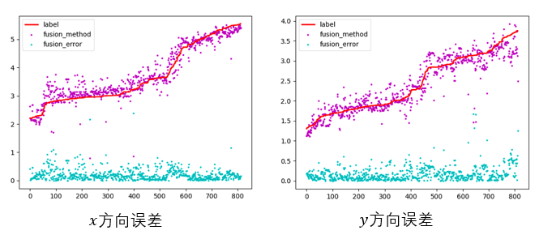

- 运行效果图
<p align="center">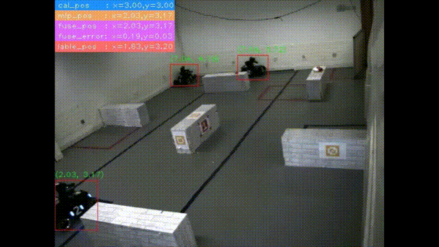

### 4 姿态估计

- 算法流程

<p align="center">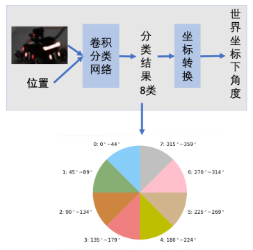

该模型由左、右两侧哨兵视角的角度分类网络构成。以左侧哨兵视角为例，将哨兵视角下的车体目标框信息及其在世界坐标系下的（x,y）坐标输入到卷积角度分类模型中，有效地实现了角度分类。

- 位姿结果

<p align="center">

上图给出了位姿估计网络模型在左、右哨兵视角下的角度分类准确率。通过图示可以得出，通过将世界坐标系下的角度转换为相机坐标系下的角度，位姿估计模型有效地实现了角度的8分类。

- 运行效果图

### 5 基于卡尔曼的多传感器融合
- 算法流程

<p align="center">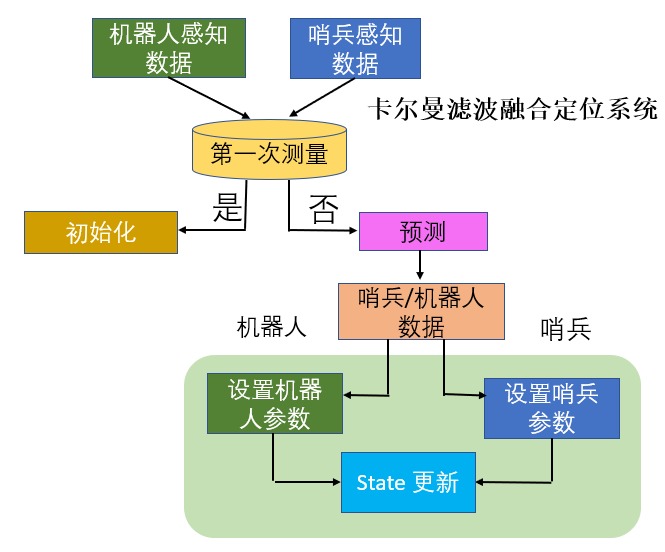
  
定位模块有多个输入来源，包括两个己方机器人的雷达传感器和两个哨兵的相机传感器，我们通过卡尔曼滤波来对传感器数据进行融合。

- 融合结果

<p align="center">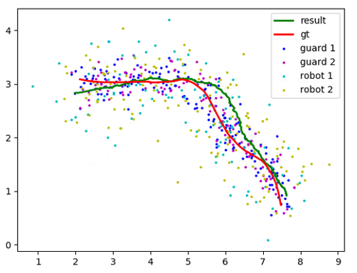
  
实验证明这种方法能有效的在含有噪声的多种传感器数据中拟合真实值

### 6 公布数据集
以上所有结果均在公布数据集上训练和测试，请点击[链接](https://pan.baidu.com/s/14o_p44uMYHcNfe80j9vjxg)下载，提取码为**fd4x**。

### 7 各模块运行速度
以上所有实验均在xxx设备上进行测试，整个代码运行时间为xx，每个模块运行时间如下：


### 配置及安装
###### 开发前的配置要求

1. xxxxx x.x.x
2. xxxxx x.x.x

###### **安装步骤**

1. Get a free API Key at [https://example.com](https://example.com)
2. Clone the repo

```sh
git clone https://github.com/DRL-CASIA/Perception.git
```

### 文件目录说明

```
filetree 
|— 6_car_fengzhuang
|                 |— data        #基于车体分类模型参数
|                 |— classification_car.py   #基于车体分类函数封装
|                 |— LeNet_car.py         #基于车体分类模型定义
|— 8_classification_camera_fengzhuang
|                 |— data        #基于车体角度回归模型参数
|                 |— classification_angle_camera.py   #基于车体角度回归函数封装
|                 |— LeNet_angle.py         #基于车体角度回归模型定义
|
|— armor_6_fengzhuang
|                 |— data        #基于装甲板分类模型参数
|                 |— classification.py   #基于装甲板分类函数封装
|                 |— LeNet.py         #基于装甲板分类模型定义
|
|— cfg                             #yolo以及位置预测模型参数文件夹
|— utils                            #辅助函数，用于读取yolo配置文件
|— video_footage                    #测试视频及图片文件夹
|— armor_detect.py                  #基于车体框灯条检测算法
|— armor_detect_with_yolo_withlightbox_v3.py    #主函数
|— armor_detect_with_yolo_withlightbox_v4.py    #主函数并行版本
|— armor_detect_withlightbox.py       #基于装甲板灯条检测算法
|— dog-cycle-car.jpg                 #yolo测试图
|— models_nolambda_focallossw.py     #根据配置文件定义yolov3模型结构，读取权重
|— position_predict.py                #基于车体框位置预测以及位置融合算法
|— preprocess.py                    #图像处理，resize等  
|— yolo_detect_v2.py                 #yolo算法


```


### 软件效果展示 


### 依赖工具及环境

暂无

### 编译及安装方式

- [xxxxxxx](https://getbootstrap.com)
- [xxxxxxx](https://jquery.com)
- [xxxxxxx](https://laravel.com)

### 软硬件系统框图


#### 原理介绍与理论支持分析

贡献使开源社区成为一个学习、激励和创造的绝佳场所。你所作的任何贡献都是**非常感谢**的。


1. Fork the Project
2. Create your Feature Branch (`git checkout -b feature/AmazingFeature`)
3. Commit your Changes (`git commit -m 'Add some AmazingFeature'`)
4. Push to the Branch (`git push origin feature/AmazingFeature`)
5. Open a Pull Request


### 软件架构与层级图

该项目使用Git进行版本管理。您可以在repository参看当前可用版本。

### 开源协议

该项目签署了MIT 授权许可，详情请参阅 [LICENSE.txt](https://github.com/DRL-CASIA/Perception/blob/master/LICENSE.txt)

### 设计模式

### 鸣谢


<!-- - [GitHub Emoji Cheat Sheet](https://www.webpagefx.com/tools/emoji-cheat-sheet)
- [Img Shields](https://shields.io)
- [Choose an Open Source License](https://choosealicense.com)
- [GitHub Pages](https://pages.github.com)
- [Animate.css](https://daneden.github.io/animate.css)
- [xxxxxxxxxxxxxx](https://connoratherton.com/loaders) -->

<!-- links -->
[your-project-path]:DRL-CASIA/Perception
[contributors-shield]: https://img.shields.io/github/contributors/DRL-CASIA/Perception.svg?style=flat-square
[contributors-url]: https://github.com/DRL-CASIA/Perception/graphs/contributors
[forks-shield]: https://img.shields.io/github/forks/DRL-CASIA/Perception.svg?style=flat-square
[forks-url]: https://github.com/DRL-CASIA/Perception/network/members
[stars-shield]: https://img.shields.io/github/stars/DRL-CASIA/Perception.svg?style=flat-square
[stars-url]: https://github.com/DRL-CASIA/Perception/stargazers
[issues-shield]: https://img.shields.io/github/issues/DRL-CASIA/Perception.svg?style=flat-square
[issues-url]: https://img.shields.io/github/issues/DRL-CASIA/Perception.svg
[license-shield]: https://img.shields.io/github/license/DRL-CASIA/Perception.svg?style=flat-square
[license-url]: https://github.com/DRL-CASIA/Perception/blob/master/LICENSE
[linkedin-shield]: https://img.shields.io/badge/-LinkedIn-black.svg?style=flat-square&logo=linkedin&colorB=555
[linkedin-url]: https://linkedin.com/in/zhentaotang
